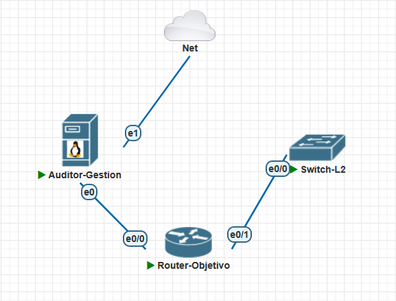
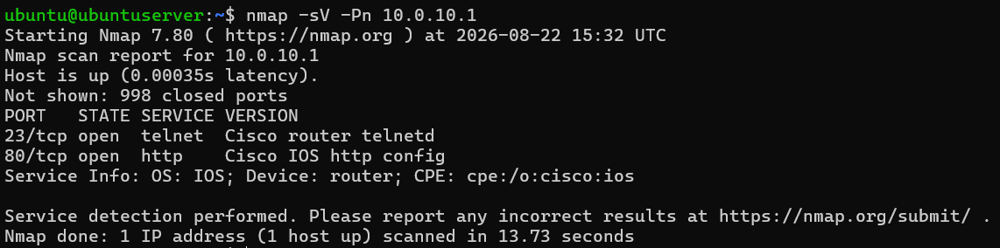
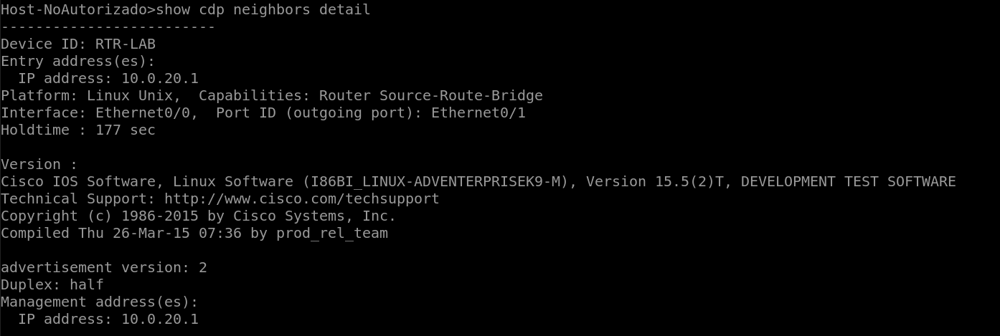
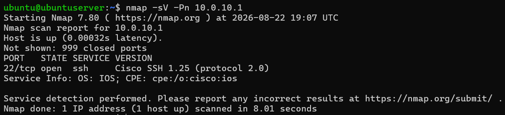
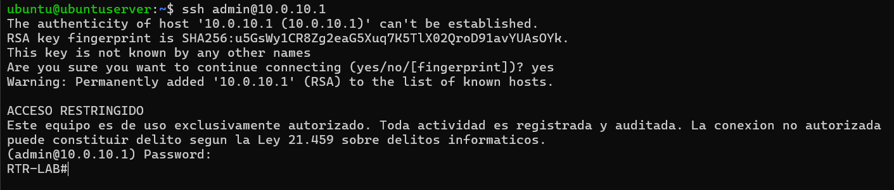
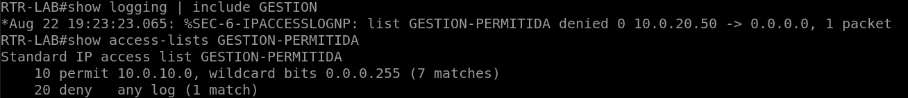

## Contexto

Es muy común encontrarse con equipos de red que nadie configuró pensando en la seguridad. A veces, un switch lleva años en el rack y un router lo dejó instalado un proveedor, dejando solo la configuración mínima para que el internet funcione. En estos casos, casi nadie se detiene a revisar qué servicios quedan expuestos.

Este laboratorio busca reproducir ese problema para luego solucionarlo. Primero, configuré un router Cisco con los ajustes que trae de fábrica y escaneé los servicios que ofrecía. Después, definí una política de hardening y justifiqué cada control aplicado. Finalmente, volví a escanear el router Cisco para comprobar qué cambios se hicieron realmente.

Mi objetivo no era simplemente aplicar una lista de reglas sin sentido. Quería decidir qué controles son los más importantes para este escenario y poder defender cada decisión tomada.

### Entorno

Todo montado en PNETLab. Tres nodos:



| Nodo | Rol | Dirección |
|---|---|---|
| Ubuntu Server | Auditor, desde donde escaneo | 10.0.10.50/24 |
| Router Cisco IOS 15.5(2)T | El equipo a endurecer | e0/0: 10.0.10.1 · e0/1: 10.0.20.1 |
| Switch Cisco L2 | Host en zona no autorizada | 10.0.20.50/24 |

La red queda partida en dos: `10.0.10.0/24` es la zona de gestión y `10.0.20.0/24` la de usuarios. El switch no hace de switch acá, hace de equipo cualquiera conectado en la zona de usuarios — sirve para probar si alguien desde ahí puede llegar a administrar el router.

## Línea base

Antes de tocar nada configuré el router como llegaría de fábrica con lo justo para funcionar: contraseñas en texto plano, acceso remoto sin restricción y el servidor web activo.

```
hostname RTR-LAB
!
interface Ethernet0/0
 ip address 10.0.10.1 255.255.255.0
 no shutdown
!
interface Ethernet0/1
 ip address 10.0.20.1 255.255.255.0
 no shutdown
!
enable password cisco123
!
line vty 0 4
 password cisco123
 login
 transport input all
!
ip http server
```

Desde el auditor:

```bash
nmap -sV -Pn 10.0.10.1
```



> **Dos puertos abiertos.** Telnet en el 23 y el servidor web de IOS en el 80. Ninguno de los dos cifra nada.

Confirmé que Telnet efectivamente daba acceso administrativo con `telnet 10.0.10.1`, y desde ahí llegué al modo privilegiado con la contraseña `cisco123`. Cualquiera con acceso al segmento y un analizador de tráfico se lleva esas credenciales completas.

En la configuración se veía el resto del problema: `no service password-encryption`, sin banner, sin timeouts de sesión, sin AAA.

```
version 15.5
no service password-encryption
hostname RTR-LAB
enable password cisco123
no aaa new-model
...
ip http server
no ip http secure-server
...
line vty 0 4
 password cisco123
 login
 transport input all
```

### La fuga que no aparece en el escaneo

Un puerto abierto se ve en `nmap`. Esto no:



Desde el switch, en la zona de usuarios, un simple `show cdp neighbors detail` entrega el nombre del equipo, su dirección de gestión, y la versión exacta de IOS: `15.5(2)T`. Con ese dato alguien busca las vulnerabilidades conocidas de esa versión y ya sabe por dónde empezar, sin haber lanzado un solo paquete ofensivo.

Un detalle del laboratorio: la plataforma aparece como `Linux Unix` porque IOL corre IOS sobre Linux. En un equipo físico ahí saldría el modelo real, así que la fuga sería peor.

**Hallazgos de la línea base:**

| # | Hallazgo | Riesgo |
|---|---|---|
| 1 | Telnet habilitado | Credenciales en texto plano |
| 2 | Servidor HTTP activo | Servicio innecesario expuesto |
| 3 | Contraseñas sin cifrar en la configuración | Un respaldo filtrado entrega el acceso |
| 4 | Acceso remoto sin restricción de origen | Cualquier zona puede intentar administrar |
| 5 | Sin timeouts de sesión | Sesión olvidada = acceso sin autenticación |
| 6 | Sin banner legal | Consentimiento implícito para un intruso |
| 7 | CDP anunciando versión de IOS a la zona de usuarios | Reconocimiento gratis |

## Política de hardening

Antes de escribir un comando definí qué iba a aplicar y por qué. Once controles en tres planos.

### Plano de gestión

| Control | Justificación |
|---|---|
| SSH v2, sin Telnet | Cifra el canal y las credenciales en tránsito. Cierra el sniffing pasivo y complica el man-in-the-middle. |
| Usuario local con `secret` | Da trazabilidad individual en vez de una contraseña compartida, y guarda la clave con hash en vez de texto reversible. |
| `enable secret` + cifrado de contraseñas | Que un respaldo de configuración filtrado no entregue credenciales usables directamente. |
| `exec-timeout` | Cierra sesiones inactivas. Una terminal olvidada abierta es acceso administrativo sin autenticación. |
| Banner legal | Elimina el consentimiento implícito y deja constancia formal de la prohibición. No es decorativo: es lo que permite perseguir un acceso no autorizado. |
| ACL de gestión | Mínimo privilegio a nivel de red. Solo la subred de administración puede siquiera intentar conectarse a las líneas VTY. |
| `login block-for` | Frena fuerza bruta y diccionario bloqueando el login tras varios fallos. |

### Plano de control

| Control | Justificación |
|---|---|
| Sin servidor HTTP | Servicio web innecesario, sin cifrado, y una superficie de ataque que no uso. |
| CDP fuera de puertos de acceso | Evita que un equipo en la zona de usuarios conozca modelo, dirección de gestión y versión de IOS. |

### Registro y plano de datos

| Control | Justificación |
|---|---|
| Logging con marca de tiempo | Sin timestamps precisos no hay correlación de eventos ni línea de tiempo reconstruible. |
| Interfaces sin uso apagadas | Un puerto activo sin propósito es un punto de entrada al conectar cualquier equipo. |

## Aplicación

Todo desde la consola de PNETLab, nunca por Telnet. A mitad de la configuración se corta el acceso remoto, así que trabajar desde la sesión que vas a matar es garantía de quedarte afuera.

### Base para SSH y credenciales:

```
ip domain-name lab.local
crypto key generate rsa modulus 2048
!
username admin privilege 15 secret <REDACTADO>
enable secret <REDACTADO>
service password-encryption
no enable password
```

### Restricción de origen:

```
ip access-list standard GESTION-PERMITIDA
 permit 10.0.10.0 0.0.0.255
 deny any log
```

El `log` en el `deny` es lo que después deja rastro del intento bloqueado. Sin eso la ACL funciona igual, pero no te enteras de que alguien lo intentó.

### Líneas de acceso:

```
line vty 0 4
 transport input ssh
 login local
 exec-timeout 5 0
 access-class GESTION-PERMITIDA in
 no password
!
line con 0
 exec-timeout 5 0
 logging synchronous
```

### SSH y freno a la fuerza bruta:

```
ip ssh version 2
ip ssh time-out 60
ip ssh authentication-retries 3
!
login block-for 120 attempts 3 within 60
login on-failure log
login on-success log
```

### Banner:

```
banner login ^
ACCESO RESTRINGIDO
Este equipo es de uso exclusivamente autorizado. Toda actividad
es registrada y auditada. La conexion no autorizada puede
constituir delito segun la Ley 21.459 sobre delitos informaticos.
^
```

### Servicios, CDP, logging e interfaces:

```
no ip http server
no ip http secure-server
!
interface Ethernet0/1
 no cdp enable
!
service timestamps log datetime msec localtime
service timestamps debug datetime msec localtime
logging buffered 16384 informational
!
interface Ethernet0/2
 description SIN USO
 shutdown
!
interface Ethernet0/3
 description SIN USO
 shutdown
```

## Verificación

Mismo escaneo que en la línea base, tres horas y media después:



> **Telnet y HTTP desaparecieron.** Queda solo el 22 con SSH 2.0.

| | Antes | Después |
|---|---|---|
| 23/tcp Telnet | Abierto | Cerrado |
| 80/tcp HTTP | Abierto | Cerrado |
| 22/tcp SSH | — | Abierto |

Telnet ahora rechaza la conexión:

```
$ telnet 10.0.10.1
Trying 10.0.10.1...
telnet: Unable to connect to remote host: Connection refused
```

Y SSH desde la zona de gestión entra mostrando el banner:



### La ACL haciendo su trabajo

Esta es la parte que importa. Desde el switch, en la zona de usuarios, el intento de conexión:

```
Host-NoAutorizado#telnet 10.0.10.1 22
Trying 10.0.10.1, 22 ...
% Connection refused by remote host
```

Y en el router quedó el registro:



```
%SEC-6-IPACCESSLOGNP: list GESTION-PERMITIDA denied 0 10.0.20.50 -> 0.0.0.0, 1 packet

Standard IP access list GESTION-PERMITIDA
    10 permit 10.0.10.0, wildcard bits 0.0.0.255 (7 matches)
    20 deny   any log (1 match)
```

> **Los contadores son la evidencia.** No demuestran que la regla existe, demuestran que se está aplicando. 

Siete coincidencias en el `permit` son mis propias conexiones desde el auditor; la única del `deny` es el intento desde la zona de usuarios.

Vale precisar qué prueba esto exactamente: la conexión se rechaza en la línea VTY, **antes** de llegar a pedir credenciales. No es que la autenticación falle. Es que nunca ocurre.

## Lo que se me rompió

**El Ubuntu venía con una sola interfaz.** La ocupé conectándolo al router y después me di cuenta de que necesitaba una segunda para llegar a internet e instalar `nmap`. Se resuelve editando el nodo en la topología y agregando interfaces Ethernet, pero hay que hacerlo antes de arrancar la máquina.

**No pude usar la consola del Ubuntu cómodamente.** Terminé conectándome por SSH desde mi equipo Windows. Funciona bien y de paso es más parecido a cómo se trabaja de verdad, pero perdí un rato buscando por qué la consola integrada no me servía.

**El switch no tenía cliente SSH.** Acá estuvo el problema real. Mi imagen IOL de switch L2 es non-k9, o sea sin paquete criptográfico: no puede generar claves RSA ni establecer sesiones SSH. Eso rompía la prueba de la ACL, que era justamente comprobar que un equipo de la zona de usuarios no puede administrar el router.

La salida fue apuntar Telnet al puerto de SSH:

```
telnet 10.0.10.1 22
```

Como la ACL se evalúa en la línea VTY sin importar el protocolo, el rechazo ocurre igual y queda registrado igual. No es la prueba ideal —no verifica el intercambio SSH— pero sí verifica exactamente lo que la ACL debe hacer: cortar la conexión antes de la autenticación.

## Revisión de la configuración final

Con todo aplicado volví a leer la configuración completa, que es lo que haría alguien auditando el equipo desde afuera. Aparecieron dos cosas que se me habían pasado.

### El hash de las contraseñas quedó en Type 5

```
enable secret 5 $1$<REDACTADO>
username admin privilege 15 secret 5 $1$<REDACTADO>
```

Ese prefijo `$1$` es MD5. O sea: apliqué el control, la contraseña quedó con hash, y el hash es débil. MD5 se calcula muy rápido, y eso es exactamente lo que quiere alguien probando millones de candidatas contra un archivo de configuración filtrado.

Lo recomendado hoy es Type 8 (PBKDF2-SHA256) o Type 9 (scrypt). Probé si la imagen lo soportaba y sí:

```
enable algorithm-type scrypt secret <REDACTADO>
username admin privilege 15 algorithm-type scrypt secret <REDACTADO>
```

Ahora los hashes salen con prefijo `$9$`

```
RTR-LAB#show running-config | include secret
enable secret 9 $9$<REDACTADO>
username admin privilege 15 secret 9 $9$<REDACTADO>
```

La diferencia no está en que "esté cifrado" —ya lo estaba— sino en cuánto cuesta romperlo por fuerza bruta.

Vale la pena separar los dos errores acá. El primero fue no especificar el algoritmo: `secret` sin más usa el que la imagen tenga por defecto, y ese defecto puede ser de hace veinte años. El segundo fue mío al redactar la política: escribí "hashing fuerte (Type 5/8/9)" metiendo Type 5 en la misma bolsa que los otros dos, cuando no pertenece ahí.

### El puerto auxiliar quedó sin tocar

```
line aux 0
```

Así, sin nada debajo. Al armar la política pensé en consola y en VTY, y el puerto auxiliar no apareció en mi lista. Es un acceso administrativo que sigue habilitado.

```
line aux 0
 no exec
 transport input none
```

`no exec` impide que se abra una sesión interactiva por esa línea y `transport input none` bloquea las conexiones entrantes.

No es un puerto que alguien alcance por la red —requiere acceso físico o un servidor de consola—, pero es justo el tipo de control que se omite por costumbre y después aparece en un informe de auditoría. Que se me haya pasado al definir la política y aparecido al releerla dice algo sobre para qué sirve releer.

## Decisiones y límites

### CDP: lo dejé activo a medias

Lo saqué de `Ethernet0/1`, que da hacia usuarios, y lo dejé en `Ethernet0/0`, hacia gestión.

Apagarlo completo es más seguro y rompe el descubrimiento de topología entre equipos legítimos, que es una herramienta útil para operar y diagnosticar. La fuga importa cuando el que escucha no debería estar ahí. En la zona de gestión, quien está conectado ya tiene acceso administrativo — el CDP no le entrega nada que no pueda obtener de otra forma.

### `exec-timeout` en 5 minutos

Es un valor de compromiso. Un minuto hace la administración insoportable y termina en gente dejando sesiones abiertas por otras vías. Quince minutos es demasiado tiempo con una terminal desatendida. Cinco es incómodo pero tolerable, y ese es el punto donde un control se cumple en vez de sabotearse.

### Sin AAA centralizado

La autenticación quedó local. En producción esto debería ir contra TACACS+ o RADIUS: usuarios locales en cada equipo no escalan, no revocan bien y no dejan registro central. No lo monté porque requiere infraestructura fuera del alcance de este lab, pero es la brecha más grande de la configuración final.

### `service password-encryption` no cifra nada útil

Está aplicado y sirve, pero conviene saber qué hace y qué no. Lo que produce es Type 7, un cifrado reversible que se deshace con cualquier herramienta en línea en segundos. Protege contra alguien que mira la pantalla por encima del hombro. No protege contra alguien que obtiene el archivo de configuración.

### La verificación fue solo TCP

`nmap -sV -Pn` recorre los mil puertos TCP más comunes. No tocó UDP, y ahí vive SNMP en el 161 — que en muchos equipos viene con comunidades por defecto y es una de las fugas de información más comunes en infraestructura de red. Este lab no lo verificó.

### Lo que este hardening no cubre

- **Acceso físico.** Quien llegue al equipo puede hacer recuperación de contraseña por consola.
- **Firmware.** Endurecer la configuración no arregla vulnerabilidades de IOS 15.5(2)T. Un inventario de versiones y su gestión de parches es un problema aparte.
- **Registro persistente.** El logging es local en buffer. Se pierde al reiniciar y alguien con acceso privilegiado lo borra con un comando. Sin syslog remoto no hay evidencia que sobreviva a un compromiso.
- **Sincronización horaria.** Sin NTP, las marcas de tiempo del equipo no correlacionan con las de ningún otro sistema. Para reconstruir un incidente que cruza varios equipos, eso lo vuelve inservible.

Los dos últimos son el siguiente lab.
