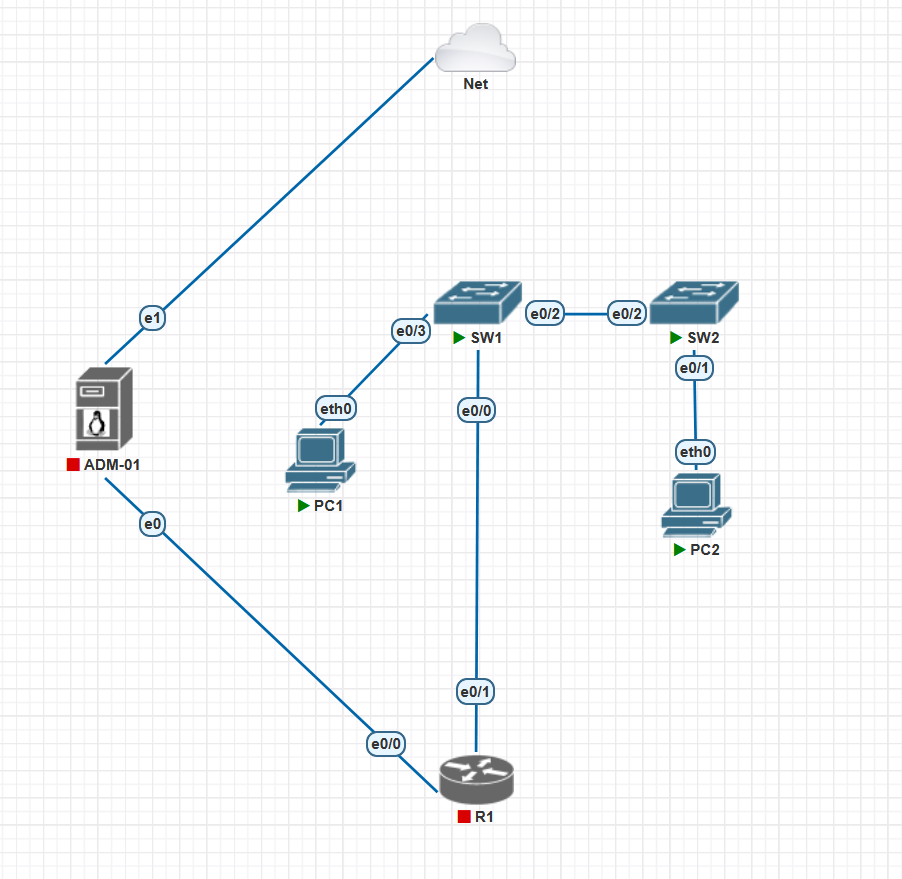

## Contexto y alcance

Un router recién instalado espera instrucciones que no recibió. Un switch de fábrica no espera nada: llega con protocolos encendidos que negocian el rol de cada enlace y eligen una topología solos. Cuando encendí los dos switches, la red ya estaba armada.

El problema es distinto al del lab del router. Allá lo expuesto era el plano de gestión: Telnet, contraseñas en claro, el servidor web de IOS, servicios que nadie apagó. Acá el equipo tomó una postura de diseño por su cuenta y la aplicó. El método que uso es el mismo de siempre: línea base, política justificada, aplicación y verificación.

### Lo que la plataforma no permite

La imagen IOSvL2 de PNETLab no trae paquete criptográfico:

```
Switch#crypto key generate rsa
        ^
% Invalid input detected at '^' marker.
```

Sin claves RSA no hay SSH, y sin SSH la única administración remota sería Telnet en texto plano. Es la misma limitación del lab del router, confirmada ahora en un segundo equipo.

Eso acota el lab de entrada. Dejé de perseguir el plano de gestión y me concentré donde el switch tiene superficie propia: los protocolos que negocian y confían por defecto.

## Topología



| Nodo | Rol | Enlaces |
|---|---|---|
| R1 | Router del lab anterior, ya endurecido | e0/1 a SW1 · e0/0 a ADM-01 |
| SW1 | Distribución. `aabb.cc00.0100`, 4 puertos | e0/0 a R1 · e0/2 a SW2 · e0/3 a PC1 |
| SW2 | Acceso. `aabb.cc00.0200`, 20 puertos | e0/2 a SW1 · e0/1 a PC2 |
| PC1 | 192.168.10.11/24 · `00:50:79:66:68:09` | eth0 a SW1 |
| PC2 | 192.168.10.12/24 · `00:50:79:66:68:0a` | eth0 a SW2 |
| ADM-01 | Puesto de gestión, Ubuntu Server | e0 a R1 · e1 a Net |
| Net | Salida a internet | e1 de ADM-01 |

ADM-01 se conecta directo a R1, sin pasar por ningún switch, así que queda fuera del alcance. PC1 y PC2 cuelgan de switches distintos: el tráfico entre ellos cruza el troncal. Los dos switches corren IOS 15.1.

### Decisiones de armado

- **Trabajé sobre una copia del laboratorio anterior.** Lo exporté e importé con otro nombre: el original es la evidencia de un lab publicado.
- **Renombré los nodos por función.** Antes eran `Router-Objetivo`, `Auditor-Gestion` y `Switch-L2`. Un nombre atado al lab de turno deja de ser cierto en la segunda iteración.
- **La asimetría de puertos no la elegí, pero la usé.** Viene de las plantillas de PNETLab. Un switch de acceso con 20 puertos y dos en uso le da material real al control de puertos sin uso.
- **SW1 venía del lab anterior y lo verifiqué en vez de resetearlo.** Su `running-config` daba 653 bytes, con el hostname de fábrica y ninguna VLAN agregada.

## Línea base

El estado de fábrica cabe en seis líneas:

```
SW1#show interfaces trunk

Port        Mode             Encapsulation  Status        Native vlan
Et0/2       desirable        n-isl          trunking      1

Port        Vlans allowed on trunk
Et0/2       1-4094
```

SW2 reportaba lo mismo desde su lado.

> **Tres decisiones que yo no tomé.** El enlace entre los switches es troncal, habla ISL y está autorizado a transportar el rango completo de VLANs.

La encapsulación salió de la misma negociación: `n-isl` es ISL, un formato propietario antiguo. Cuál de los dos formatos ganó da lo mismo, porque lo eligió un protocolo y no yo. Y `1-4094` autoriza al enlace a llevar cualquier VLAN que llegue a existir.

La VLAN nativa es la 1, la misma de los datos: lo que cruce sin etiqueta comparte espacio con lo productivo.

### Todos los puertos vienen negociando

El troncal no es un caso especial: es lo que pasa cuando dos puertos de fábrica se encuentran. Todos vienen en `dynamic desirable`, o sea que proponen convertirse en troncal. Un puerto de acceso de SW1, recortado:

```
SW1#show interfaces switchport
Name: Et0/0
Administrative Mode: dynamic desirable
Operational Mode: static access
Negotiation of Trunking: On
...
```

Los otros tres repiten el bloque. Lo único distinto es `Operational Mode`, y solo porque a Et0/2 le apareció un interlocutor. En un puerto donde se conecta un usuario, `Negotiation of Trunking: On` significa que está dispuesto a volverse troncal si el equipo del otro lado se lo pide.

Un detalle de la plataforma:

```
SW1#show interfaces status

Port      Name               Status       Vlan       Duplex  Speed Type
...
Et0/1                        connected    1            auto   auto unknown
...
```

Et0/1 no tiene nada enchufado y dice `connected` igual; en hardware real diría `notconnect`. La lista de puertos libres tiene que salir de la documentación, no del switch.

### La raíz la decidió una dirección MAC

```
SW1#show spanning-tree vlan 1

VLAN0001
  Root ID    Priority    32769
             Address     aabb.cc00.0100
             This bridge is the root
```

Los dos tienen la prioridad por defecto, 32769, así que el desempate lo resolvió la MAC más baja y ganó SW1. Coincide con lo que el diseño querría, pero es suerte: con la dirección de SW2 más baja la raíz habría quedado en el switch de acceso, y el tráfico hacia R1 daría un rodeo.

### El plano de gestión, sin tocar

```
no service password-encryption
...
line con 0
 logging synchronous
line aux 0
line vty 0 4
```

No hay `enable secret` ni `enable password`: quien llegue a la consola pasa a modo privilegiado escribiendo `enable`. Las cinco VTY están sin autenticación ni restricción de transporte, y la `line aux 0` está presente y vacía, la misma que se me pasó en el lab del router.

De fábrica los dos se llaman `Switch`, y así los reportaba `show cdp neighbors`: con equipos homónimos ningún registro es atribuible. Los hostnames de arriba ya están corregidos, los cambié antes de la línea base.

### Hallazgos de la línea base

| # | Hallazgo | Riesgo |
|---|---|---|
| 1 | El enlace entre switches se volvió troncal por negociación | Un puerto cambia de rol sin que nadie lo decida |
| 2 | Encapsulación ISL elegida por el protocolo | El formato lo fija DTP, no el diseño |
| 3 | Troncal autorizado a transportar 1-4094 | Cualquier VLAN futura cruza el enlace |
| 4 | VLAN nativa 1, la misma de los datos | El tráfico sin etiqueta va con lo productivo |
| 5 | Todos los puertos en `dynamic desirable` | Un puerto de usuario puede volverse troncal |
| 6 | Raíz del spanning tree resuelta por la MAC más baja | La topología lógica queda al azar |
| 7 | Sin contraseña de modo privilegiado | Consola equivale a control total |
| 8 | `no service password-encryption` | Lo que se configure después queda legible |
| 9 | VTY y línea auxiliar sin restricción | Dos vías de administración sin autenticación |
| 10 | Los dos equipos se llaman `Switch` | Ningún registro es atribuible |

## Preparación e instrumentación

Antes de aplicar ningún control preparé los equipos para poder medir. Nada de lo que hay acá reduce superficie de ataque, y por eso va separado de la política.

Cada switch quedó con un nombre propio, para que los mensajes de registro sean atribuibles. Habilité el buffer de registro en los dos, 16384 bytes, y creé las VLANs 998 y 999 vacías, con números bien fuera del rango de datos para que se note que no son productivas. El reloj lo ajusté a mano en ambos.

Y no sobrevive un reinicio: al volver al día siguiente tuve que ajustarlo de nuevo. Van dos veces en un laboratorio de dos días.

Después verifiqué que la preparación no hubiera tocado nada. `show interfaces trunk` seguía en `desirable` con `n-isl`.

## Política de controles

Con la línea base leída y antes de tocar nada, escribí la política: once controles, cada uno con el riesgo que cubre. Escribirla antes es lo que permite después decir si un control se aplicó o no, en vez de justificar lo que salió.

El control 3 quedó parcial, en cuatro de cinco componentes. Qué faltó y por qué lo cuento en Decisiones y límites.

| # | Control | Riesgo que cubre | Estado |
|---|---|---|---|
| 1 | Contraseña de modo privilegiado y cifrado de contraseñas | Cualquiera con acceso a consola pasa a privilegiado sin autenticarse | Aplicado |
| 2 | `transport input none` en vty, línea auxiliar deshabilitada | Sin SSH disponible, no se deja Telnet en claro | Aplicado |
| 3 | Troncal fijo: encapsulación explícita, modo trunk, sin negociación | El enlace deja de negociar; la encapsulación la decide el diseño | **Parcial** |
| 4 | VLAN nativa 999, sin uso | El tráfico sin etiqueta deja de compartir VLAN con los datos | Aplicado |
| 5 | VLANs permitidas acotadas en el troncal | El enlace transporta solo lo autorizado, no 1-4094 | Aplicado |
| 6 | Puertos de acceso en modo estático | Un puerto de cliente no puede convertirse en troncal | Aplicado |
| 7 | Prioridad de spanning tree fijada | La topología la decide el diseño, no la MAC más baja | Aplicado |
| 8 | BPDU guard en puertos de acceso | Un equipo conectado abajo no influye en la topología | Aplicado |
| 9 | Puertos sin uso apagados y en VLAN 998 | Conectarse a un puerto libre no da acceso | Aplicado |
| 10 | Límite de direcciones por puerto | Un equipo por puerto de acceso | Aplicado |
| 11 | CDP apagado en puertos de acceso | El switch deja de anunciarse a los clientes | Aplicado |

## Aplicación y verificación

Apliqué en el orden de la tabla y siempre desde la consola. El troncal es donde está el hallazgo principal, así que ese va con su antes y después. Como estaba:

```
Port        Mode             Encapsulation  Status        Native vlan
Et0/2       desirable        n-isl          trunking      1
```

Y como quedó, con la encapsulación declarada, el modo fijo y la VLAN nativa fuera de los datos:

```
Port        Mode             Encapsulation  Status        Native vlan
Et0/2       on               802.1q         trunking      999
```

Las VLANs permitidas pasaron de `1-4094` a `1,999`. Dejé la 998 fuera a propósito: es donde estaciono los puertos sin uso, y si cruzara el troncal dos puertos estacionados en switches distintos se verían entre sí.

### La ventana de cambio quedó registrada

Apliqué en SW1 y esperé antes de hacerlo en SW2, para capturar el desajuste. Los dos equipos reportaron el mismo problema desde su propio punto de vista, con las VLANs invertidas:

```
SW1: %CDP-4-NATIVE_VLAN_MISMATCH: ... on Ethernet0/2 (999), with SW2 Ethernet0/2 (1).
SW2: %CDP-4-NATIVE_VLAN_MISMATCH: ... on Ethernet0/2 (1), with SW1 Ethernet0/2 (999).
```

Se repitió cada 60 segundos, que es el intervalo de anuncio de CDP, desde las 20:25:28 hasta que el cambio quedó parejo en ambos lados. Cinco minutos de inconsistencia con su hora de inicio y su hora de término, porque mientras el desajuste existió los dos equipos lo siguieron reportando.

### Los puertos de acceso apagan la negociación solos

| Puerto | Comando | Negotiation of Trunking |
|---|---|---|
| Troncal | `switchport mode trunk` | On |
| Acceso | `switchport mode access` | Off |

Lo medí en los dos modos antes de darlo por bueno. Fijar un puerto en modo acceso apaga la negociación por sí solo; fijarlo en trunk no. Así que la falta de `nonegotiate` me complica el enlace entre switches y me deja tranquilo en los puertos de usuario.

### Los demás controles

La prioridad de spanning tree quedó en 4096 para SW1 y 8192 para SW2, aplicada a las tres VLANs, con valores efectivos de 4097 y 8193: SW2 pasa a ser el respaldo declarado en vez de dejar la sucesión al azar. En los puertos de equipo final puse portfast y BPDU guard. Los puertos libres de SW2 primero los mandé a la VLAN 998 y después los apagué, en ese orden. Cada puerto de acceso quedó con una sola dirección permitida y aprendizaje sticky, y les dejé modos de violación distintos a propósito: `shutdown` en SW1 y `restrict` en SW2. CDP se apagó en los puertos de usuario. Para cerrar la administración remota usé `transport input none` y `transport output none` en las VTY, más `no exec` en la auxiliar. Y el plano de gestión quedó con `enable secret`, `service password-encryption`, contraseña con `login` en la consola y `exec-timeout 5 0`.

Et0/0 de SW1, que va al router, quedó fuera de tres controles: no lleva portfast, ni BPDU guard, ni port-security. Ese criterio, el del CDP selectivo y el de cerrar la administración remota los explico en Decisiones y límites.

El ping entre PC1 y PC2 seguía pasando al final, así que ninguno de los once controles cortó el servicio.

### Contraste medible

| | Antes | Después |
|---|---|---|
| Modo del troncal | `desirable` | `on` |
| Encapsulación | `n-isl` negociada | `802.1q` declarada |
| VLAN nativa | 1 | 999 |
| VLANs en el troncal | 1-4094 | 1,999 |
| Prioridad STP | 32769 en ambos | 4097 / 8193 |
| Puertos de SW2 en VLAN 1 | 19 | 1 |
| Puertos de SW2 en VLAN 998 | 0 | 18 |
| Instancias STP activas en SW2 | 20 | 2 |
| Límite de direcciones por puerto | Sin configurar | 1, con dos modos de violación |
| Administración remota | VTY abiertas sin autenticación | Cerrada, solo consola |
| Modo privilegiado | Sin contraseña | `enable secret` |

## Demostración: port-security

Creé PC3, un equipo nuevo con dirección propia, y lo conecté al puerto de SW1 autorizado para PC1. Es el escenario que el control existe para cubrir: alguien desenchufa el equipo legítimo y pone el suyo.

El puerto reaccionó con cuatro mensajes:

```
%PM-4-ERR_DISABLE: psecure-violation error detected on Et0/3, putting Et0/3 in err-disable state
%PORT_SECURITY-2-PSECURE_VIOLATION: Security violation occurred, caused by MAC address 0050.7966.680c on port Ethernet0/3.
%LINEPROTO-5-UPDOWN: Line protocol on Interface Ethernet0/3, changed state to down
%LINK-3-UPDOWN: Interface Ethernet0/3, changed state to down
```

La dirección que reporta el segundo mensaje es la de PC3, así que el switch atribuyó bien.

### Los dos modos no se parecen

| | `shutdown` (SW1) | `restrict` (SW2) |
|---|---|---|
| Estado del puerto | `err-disabled` | `up / connected` |
| Visibilidad de la falla | Inmediata | Ninguna |
| Requiere intervención | Sí | No |
| Mensajes generados | 4 | 1 |

`restrict` parece el modo suave y en la práctica es el silencioso: no interrumpe el puerto, pero sí el servicio. El de SW2 estuvo caído de un día para otro viéndose sano en `show interfaces status`, con el contador subiendo de 2 a 5 sin que nada lo delatara. Tampoco se limpia solo; lo dejé en 8 como registro de lo que pasó.

### La recuperación puede dejar el puerto desprotegido

El par `shutdown` / `no shutdown` lo saca de `err-disabled`, porque no vuelve solo. La primera vez volvió arriba con la dirección como `SecureDynamic` en vez de `SecureSticky`: protegido hasta el próximo reinicio y después no. Un procedimiento que deja el puerto arriba pero desprotegido está incompleto, y es el tipo de cosa que nadie mira porque el puerto se ve bien.

## Demostración: BPDU guard

Antes de la prueba desactivé port-security en Et0/3: con los dos controles activos en el mismo puerto no habría forma de saber cuál lo dejó caído. Recableé SW2 a ese puerto y no hubo que hacer nada más, porque SW2 emite una BPDU cada dos segundos.

```
Sep  9 12:45:20.184: %LINK-5-CHANGED: Interface Ethernet0/3, changed state to administratively down
Sep  9 12:45:22.723: %SPANTREE-2-BLOCK_BPDUGUARD: Received BPDU on port Et0/3 with BPDU Guard enabled. Disabling port.
Sep  9 12:45:22.723: %PM-4-ERR_DISABLE: bpduguard error detected on Et0/3, putting Et0/3 in err-disable state
Sep  9 12:45:24.197: %LINK-3-UPDOWN: Interface Ethernet0/3, changed state to down
```

Menos de tres segundos entre levantar el puerto y que cayera. Un operador no alcanza a reaccionar: el registro es la única forma de saber qué pasó.

## Lo que se rompió

- **Verifiqué el puerto equivocado.** Revisé BPDU guard en Et0/3 de SW2, cuando el puerto de acceso de ese switch es Et0/1, y concluí que el control no estaba.
- **Limpié el registro después del evento.** En el primer intento de BPDU guard el control actuó al conectar el cable, antes de que alcanzara a escribir nada, y el `clear logging` borró la evidencia. El orden correcto es limpiar primero.
- **Casi concluyo sin reprobar.** La ausencia inicial del mensaje de violación en SW1 la iba a escribir como limitación de la plataforma. La reprueba mostró que el equipo sí lo genera: el problema era mi método, sustituir la dirección autorizada en vez de conectar un equipo distinto.
- **La recuperación de SW2 quedó a medias.** Al revertir la demostración quedó una dirección estática residual junto a la sticky, con `maximum 1`: el puerto se veía sano y el contador seguía subiendo. Apareció comparando `show port-security address` contra `show running-config interface`.
- **Cuatro puertos quedaron sin aplicar.** Los de Et4 en SW2: el rango que corrí se cortaba en Et3. Ninguna salida del equipo lo delató, porque todos dicen `connected` esté o no el cable. Lo vi en `show vlan brief`, con la VLAN 1 todavía poblada.

## Qué registro genera cada control

| | Port-security | BPDU guard |
|---|---|---|
| Mensaje de causa | `%PORT_SECURITY-2-PSECURE_VIOLATION` | `%SPANTREE-2-BLOCK_BPDUGUARD` |
| Identifica al responsable | Sí, con la MAC | No, solo el puerto |
| Mensaje genérico común | `%PM-4-ERR_DISABLE` | `%PM-4-ERR_DISABLE` |
| Estado final del puerto | `err-disabled` | `err-disabled` |

Los dos dejan el puerto igual, pero solo uno entrega un identificador que perseguir. El genérico dice que un puerto cayó, no por qué.

De los cuatro mensajes de una violación de port-security, solo el que nombra al responsable sirve para detección; los otros tres son consecuencias. Qué centralizar y qué es ruido hay que resolverlo antes de mandar nada a un servidor de registro.

Y todo esto vive en un buffer que se pierde al reiniciar, con un reloj que hay que ajustar en cada arranque. El desajuste de VLAN nativa quedó registrado en los dos switches, y correlacionarlo exige que sus horas coincidan. Ese es el lab siguiente.

## Decisiones y límites

- **`switchport nonegotiate` no existe en esta imagen.** Lo verifiqué listando las opciones de `switchport`, no deduciéndolo del error. Deja el control 3 en cuatro de cinco: el puerto ya no cambia de rol por lo que le diga el vecino, pero sigue emitiendo negociación. El riesgo quedó cubierto, el ruido no.
- **Et0/0 de SW1 quedó fuera de portfast, BPDU guard y port-security.** Va al router: es infraestructura, no un puerto donde se conecta gente, que es para lo que están pensados los tres. El switch mismo lo advierte al aplicar portfast.
- **CDP apagado puerto por puerto y no con `no cdp run`.** La forma global era más simple y parecía más segura, y habría destruido una capacidad: el mensaje de desajuste de VLAN nativa lo genera CDP. Un control no se evalúa solo por lo que bloquea.
- **Cerré la administración remota en vez de dejar Telnet con contraseña.** Sin SSH la alternativa era una vía en claro protegida por una credencial igual de expuesta. Si no se puede administrar cifrado, no se administra por red. El costo es real: si el switch se vuelve inalcanzable hay que ir a la consola. Acá no cuesta nada; en una red distribuida sí.
- **El aprendizaje sticky no respeta el máximo, y no sé por qué.** Con `maximum 1` el switch aprendió una segunda dirección y la sumó en vez de rechazarla: `Sticky MAC Addresses: 2`, contador en cero. Solo se disparó con la dirección autorizada puesta estáticamente. Quitar sticky tampoco la descarta, la convierte a dinámica. No llegué a una explicación.
